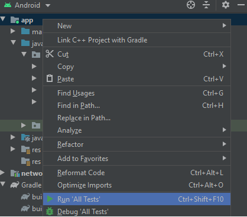

# Aplicativo de Eventos CWI - Sicredi
Aplicativo foi desenvolvido para exibição de dados de eventos disponíveis pela seguinte api:  
  - [GET Eventos](http://5f5a8f24d44d640016169133.mockapi.io/api/events)
  - [GET Evento](http://5f5a8f24d44d640016169133.mockapi.io/api/events/1)
  - [POST Check-In](http://5f5a8f24d44d640016169133.mockapi.io/api/checkin)

## Estrutura de pastas
 O Aplicativo foi desenvolvido em dois módulos. O Módulo **principal** com Layout, ViewModel e 
 Repository e o módulo de **network** onde está centralizado toda a lógica de consumo da api de 
 eventos.
Estrutura de pacotes:
 
 App
 - **module**, este pacote compreende informações para injeção de dependência;
 - **repository**, este pacote compreende a camada de domínio da aplicação, que tem por objetivo 
   encapsular regras e realizar solicitação de dados à camada de network(camada reponsável pela 
   requisição de dados da api);
 - **view**, este pacote encapsula fragmentos, activies e adapters;
 - **viewmodel**, este pacote conversa diretamente com a camada de repository e nele compreende 
   as regras para a renderização das telas pela camada de **view**;
     
 Network
 - **dto**, pacote que implementa o padrão "data transfer object" e tem como objetivo fazer a 
   transferência de dados entre o módulo de Network e App;
 - **exception**, pacote para o tratamento de erros de rede;
 - **rest**, encapsula as interfaces do retrofit para realizar as requisições;
 - **service**, pacote com classes responsáveis por realizar as requisições usando retrofit;
     
 Obs: o sistema possui um cache implementado pelo protocolo HTTP denominado HTTP Caching.

## Arquitetura

A arquitetura usada no projeto foi **MVVM**, por ser recomendada pela própria Google. 

## Library
- [AndroidX](https://developer.android.com/jetpack/androidx) utilizado, pelo fato dela ser a substituta da biblioteca Android Suport;
- [Retrofit](httpshibernate.org) utilizado, para facilitar o processo de requisição para API de eventos;
- [Koin](https://insert-koin.io/) utilizado, para injeção de dependencias no projeto;
- [Glide](https://github.com/bumptech/glide) utilizado, para fazer o gerenciamento de imagens no aplicativo;
- [Coroutines](https://developer.android.com/kotlin/coroutines?gclid=CjwKCAiAxKv_BRBdEiwAyd40N5WzWA_QgAeB-w0UXJVedXgBJnYPaSCjT-gkvLOGghk2NeHszPQeghoClpEQAvD_BwE&gclsrc=aw.ds) usado para gerenciar e executar tarefas assíncronas;
- [Mockito-Kotlin](https://github.com/nhaarman/mockito-kotlin) usado para a realização dos testes unitários, pois com essa lib podemos simular instâncias e fazer a verificação de chamada de métodos

## Testes

Os testes foram feitos para validar algumas regras existentes no ViewModel e para execução dos testes basta clicar com botão direito em cima de "app" e clicar em "Run All Tests" ou pode ser executado pelo gradle.

    
   
